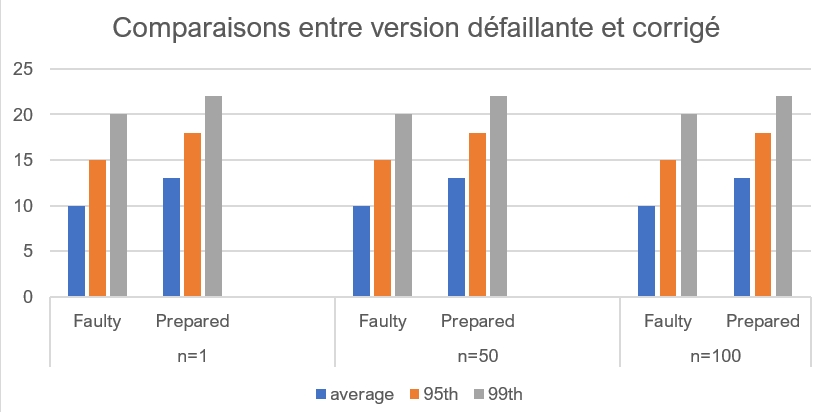

# SQLi testing et déni de service

L'objectif de cet exercice est d'implémenter une attaque SQLi qui exploite les vulnérabilités logicielles d'une application. 

## La plateforme 

1. Développez un formulaire web (ou client en ligne de commande) de connexion simple avec les champs (**Email** et **Mot de Passe**) et un bouton **Connexion**. Vous utiliserez le langage/framework de votre choix.
2. Écrivez le code serveur qui sera appelé pour authentifier un(e) utilisateur(ice). La fonction devra regarder dans une base de données SQL (Mysql, Postgres, ou SQLite), pour authentifier un utilisateur. Vous utiliserez la méthode naïve, c.-à-d. en concaténant les entrées de l'utilisateur dans une chaine de caractère qui fera la requête d'extraction.

## SQLi Testing

1. Exploiter la faille de votre protocole d'authentification afin d'effectuer une attaque qui remplacera le mot de passe administrateur de votre base de données à **SangaNdoleOkok2038**. 
Validez votre attaque en vous connectant manuellement à votre base de données.

2. Réalisez une deuxième attaque qui aura pour but de, vous authentifiez quelque soit les informations que vous allez entrer dans le système. 

3. Que préconisez-vous comme solution pour empêcher ce genre d'attaques ?

## Correction et coût sur la performance

1. Modifier le code serveur pour utiliser des *prepared request/statements* pour gérer l'authentification. 
2. Exécuter vos deux attaques précédentes et vérifier si elles aboutissent toujours.

Maintenant, on va évaluer le cout de cette correction sur la performance de notre service d'authentification. 

3. Pour cela, écrivez un script qui effectuera $n$ requêtes d'authentification par seconde, c.-à-d. envoi du couple (*email+password*) et mesure (i) la latence d'authentification moyenne, (ii) le 95 et 99ᵉ percentile. 
4. Exploiter votre script pour obtenir les trois mesures pour n=1, 50, et 100, sur une durée de 5 minutes (300s).
Vous collectez les données pour la méthode d'authentification à risque et celle utilisant les *prepared request/statements*. 
5. Tracer les résultats obtenus sur une courbe (je vous préconise des diagrammes de bars comme la figure ci-dessous) et commenter les résultats obtenus.

## Déni de service

À présent, nous allons essayer d'effectuer un déni de service sur votre application d'authentification simple. 

1. Écrire un script qui démarre plusieurs clients en parallèle avec chaque client qui effectue 100 requêtes d'authentification par seconde. Pour chaque requête, une valeur aléatoire de l'email et mot de passe doivent être généré. 
2. Exploitez le script que vous avez écrit plus haut pour obtenir les métriques (latence moyenne, 95 et 99ᵉ percentiles) pour évaluer à partir de quel nombre de clients, la latence et les percentiles chutent de plus de 40% (comparé à quand il y a un seul client).
3. Modifier le code serveur pour utiliser un pool de connexion.
4. Refaites la question 2, pour voir si le nombre de clients (nécessaire pour faire chuter la latence et percentiles de plus de 40%) a augmenté ou baisser.
5. Quel impact l'utilisation du pool a t'il eu sur la latence de votre service d'authentification ?

